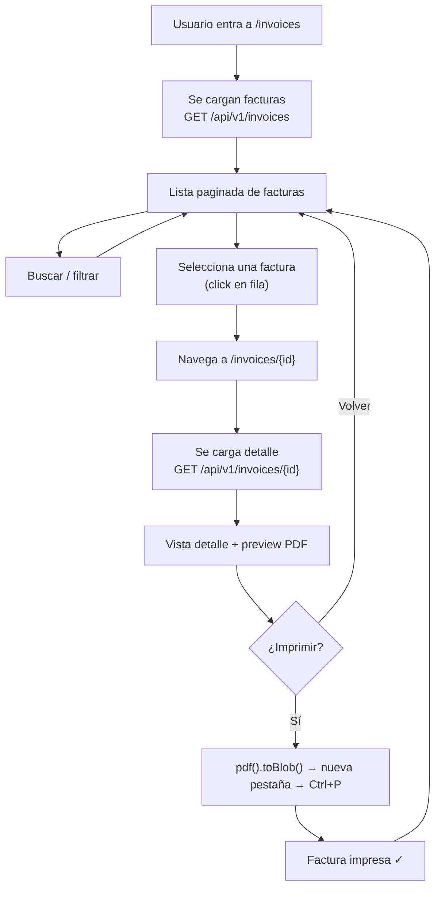

# Arquitectura: App de Consulta e Impresión de Facturas

**Aplicación Next.js + React + TypeScript INDEPENDIENTE — SOLO LECTURA**

Consulta facturas existentes, las lista, permite buscar/filtrar, previsualizar e imprimir.

**NO crea, modifica ni guarda facturas.**

---

## 1. Alcance funcional

### Lo que HACE

| # | Acción |
|---|--------|
| 1 | Consultar lista de facturas existentes desde la API |
| 2 | Listar facturas con paginación |
| 3 | Buscar y filtrar facturas (por texto, por estado) |
| 4 | Seleccionar una factura |
| 5 | Mostrar vista previa en formato de impresión |
| 6 | Imprimir la factura |

### Lo que NO HACE

- ❌ Crear facturas (`POST /invoices`)
- ❌ Modificar facturas (`PATCH /invoices/{id}`)
- ❌ Eliminar facturas (`DELETE /invoices/{id}`)
- ❌ Registrar pagos
- ❌ Gestionar clientes o productos

---

## 2. Contrato de la API

### 2.1 Headers requeridos

| Header | Valor | Origen |
|--------|-------|--------|
| `Authorization` | `Bearer {token}` | Cookie `auth_token` |
| `X-Tenant-Domain` | `demo.ispstart.com` | Host del navegador o env var en desarrollo |
| `Accept` | `application/json` | Siempre |

**Base URL**: `NEXT_PUBLIC_API_URL` (ej: `https://back.ispstart.com`)

### 2.2 Endpoints necesarios (solo 2)

#### `GET /api/v1/invoices` — Lista paginada

```
Query params:
  page=1
  per_page=10
  filter[search]=término          (texto libre)
  filter[status]=ISSUED           (DRAFT | ISSUED | PARTIALLY_PAID | PAID | CANCELED)
  filter[notification_count]=0    (opcional)
```

```jsonc
// Response
{
  "data": [
    {
      "id": "uuid",
      "customer_id": "uuid",
      "customer": {                          // ← cliente embebido
        "id": "uuid",
        "customer_type": "person",           // "person" | "company"
        "first_name": "Juan",
        "last_name": "Pérez",
        "company_name": null,
        "document_type": "CC",
        "document_number": "1234567890",
        "email": "juan@email.com",
        "address": "Calle 1 # 2-3",
        "mobile_indicative": "+57",
        "mobile": "3001234567"
      },
      "issue_date": "2025-06-15",
      "due_date": "2025-07-15",
      "status": "ISSUED",
      "subtotal": "85000",                   // ⚠️ strings
      "discount_total": "0",
      "tax_total": "16150",
      "total_amount": "101150",
      "items": [
        {
          "id": "uuid",
          "product_id": "uuid",
          "description": "Internet Fibra 100Mb",
          "quantity": 1,
          "unit_price": 85000,
          "discount": 0,
          "total": 85000
        }
      ],
      "payments": [
        {
          "id": "uuid",
          "amount": "50000",
          "payment_date": "2025-06-20",
          "payment_method": { "id": "uuid", "name": "Efectivo" },
          "status": "COMPLETED"
        }
      ],
      "subscription_period": {               // opcional
        "period_start": "2025-06-01",
        "period_end": "2025-06-30"
      },
      "period_start": "2025-06-01",          // opcional, alternativa
      "period_end": "2025-06-30",
      "period_label": "Junio 2025",          // opcional
      "notification_count": 2,
      "created_at": "2025-06-15T10:00:00Z",
      "updated_at": "2025-06-15T10:00:00Z"
    }
  ],
  "meta": {
    "current_page": 1,
    "from": 1,
    "last_page": 5,
    "per_page": 10,
    "to": 10,
    "total": 42
  }
}
```

#### `GET /api/v1/invoices/{id}` — Detalle de factura

```jsonc
// Response — mismo shape, envuelto en data
{
  "data": {
    // mismo objeto que en la lista, con customer embebido
  }
}
```

### 2.3 Respuestas de error

```jsonc
// 401
{ "message": "Unauthenticated." }

// 404
{ "message": "Invoice not found." }
```

> [!NOTE]
> Solo necesitamos 2 endpoints GET. No hay endpoints de escritura en esta app.

---

## 3. Estructura de carpetas

```
invoice-printer/
├── app/
│   ├── layout.tsx                     # Root layout (providers, metadata, font)
│   ├── page.tsx                       # Redirect → /invoices
│   ├── login/
│   │   └── page.tsx                   # Login simple (obtener token)
│   └── invoices/
│       ├── page.tsx                   # Lista de facturas
│       └── [id]/
│           └── page.tsx               # Detalle + preview + imprimir
│
├── components/
│   ├── ui/                            # Componentes base (button, input, table, etc.)
│   ├── invoice-table.tsx              # Tabla de facturas con paginación
│   ├── invoice-filters.tsx            # Barra de búsqueda + filtro por estado
│   ├── invoice-status-badge.tsx       # Badge visual del estado
│   ├── invoice-detail-card.tsx        # Card con todos los datos de la factura
│   ├── invoice-pdf-document.tsx       # Componente @react-pdf/renderer
│   ├── invoice-preview.tsx            # PDFViewer embebido
│   └── invoice-print-button.tsx       # Botón que genera blob y abre nueva pestaña
│
├── services/
│   ├── api-client.ts                  # Fetch wrapper (auth + tenant headers)
│   └── invoice.service.ts             # getInvoices(), getInvoiceById()
│
├── types/
│   ├── invoice.ts                     # Invoice, InvoiceItem, InvoiceStatus
│   ├── customer.ts                    # Customer (embebido en la factura)
│   ├── payment.ts                     # Payment (embebido en la factura)
│   └── api.ts                         # PaginatedResponse genérico
│
├── lib/
│   ├── auth.ts                        # Lectura/escritura de cookie auth_token
│   ├── tenant.ts                      # Resolución del tenant domain
│   ├── format.ts                      # formatCurrency(), formatDate()
│   └── cn.ts                          # Classname merge
│
├── config/
│   └── company.ts                     # Datos de empresa para el PDF
│
├── middleware.ts                       # Auth guard: sin token → /login
│
├── .env.example
├── .env.local
├── package.json
├── tsconfig.json
└── next.config.ts
```

---

## 4. Dependencias

```json
{
  "dependencies": {
    "next": "^15",
    "react": "^19",
    "react-dom": "^19",
    "@react-pdf/renderer": "^4",
    "js-cookie": "^3",
    "sonner": "^2",
    "lucide-react": "^1",
    "clsx": "^2",
    "tailwind-merge": "^3"
  },
  "devDependencies": {
    "typescript": "^5",
    "@types/react": "^19",
    "@types/react-dom": "^19",
    "@types/js-cookie": "^3",
    "@tailwindcss/postcss": "^4",
    "tailwindcss": "^4"
  }
}
```

> [!NOTE]
> No se necesita Zod (no hay formularios de creación), ni React Query (el flujo es simple: lista + detalle). Si preferís React Query para cache de la lista, lo agrego.

---

## 5. Variables de entorno

```bash
# Backend API
NEXT_PUBLIC_API_URL=https://back.ispstart.com

# Tenant domain (solo desarrollo local)
NEXT_PUBLIC_TENANT_DOMAIN=demo.ispstart.com
```

---

## 6. TypeScript Interfaces

### `types/api.ts`

```typescript
export interface PaginatedResponse<T> {
  data: T[];
  meta: {
    current_page: number;
    from: number;
    last_page: number;
    per_page: number;
    to: number;
    total: number;
  };
}
```

### `types/customer.ts`

```typescript
export type CustomerType = 'person' | 'company';

export interface Customer {
  id: string;
  customer_type: CustomerType;
  first_name: string | null;
  last_name: string | null;
  company_name: string | null;
  document_type: string;
  document_number: string;
  email: string;
  address: string;
  mobile_indicative: string;
  mobile: string;
}

export function getCustomerDisplayName(c: Customer): string {
  if (c.customer_type === 'company' && c.company_name) {
    return c.company_name;
  }
  return `${c.first_name ?? ''} ${c.last_name ?? ''}`.trim() || 'Sin nombre';
}
```

### `types/payment.ts`

```typescript
export interface Payment {
  id: string;
  amount: string;
  payment_date: string;
  payment_method: { id: string; name: string } | string;
  status: string;
}
```

### `types/invoice.ts`

```typescript
import type { Customer } from './customer';
import type { Payment } from './payment';

export type InvoiceStatus = 'DRAFT' | 'ISSUED' | 'PARTIALLY_PAID' | 'PAID' | 'CANCELED';

export interface InvoiceItem {
  id: string;
  product_id?: string;
  description: string;
  quantity: number;
  unit_price: number;
  discount?: number;
  total: number;
}

export interface Invoice {
  id: string;
  customer_id: string;
  customer?: Customer;
  issue_date: string;
  due_date: string;
  status: InvoiceStatus;
  subtotal: string;            // string from backend
  discount_total: string;
  tax_total: string;
  total_amount: string;
  items: InvoiceItem[];
  payments?: Payment[];
  period_start?: string;
  period_end?: string;
  period_label?: string;
  subscription_period?: {
    period_start: string;
    period_end: string;
  };
  notification_count?: number;
  created_at: string;
  updated_at: string;
}

/** Filtros para la lista */
export interface InvoiceFilters {
  search: string;
  status: InvoiceStatus | '';
}
```

---

## 7. Services

### `services/api-client.ts`

```
Wrapper de fetch:
  - Lee token de cookie "auth_token"
  - Resuelve tenant domain desde host o env var
  - Inyecta Authorization, X-Tenant-Domain, Accept
  - En 401 → redirige a /login
  - Parsea errores del body JSON
  - Expone: get<T>(path, params?)
```

### `services/invoice.service.ts`

```
getInvoices(page, perPage, search?, status?): Promise<PaginatedResponse<Invoice>>
  → GET /api/v1/invoices?page=...&per_page=...&filter[search]=...&filter[status]=...

getInvoiceById(id): Promise<Invoice>
  → GET /api/v1/invoices/{id} → extraer .data
```

Solo 2 funciones. Toda la app depende de estas dos.

---

## 8. Componentes

### Árbol de componentes

```
app/invoices/page.tsx                    ← PÁGINA: Lista
├── InvoiceFilters                       ← Búsqueda + filtro estado
└── InvoiceTable                         ← Tabla paginada
    └── InvoiceStatusBadge (por fila)    ← Badge de estado

app/invoices/[id]/page.tsx               ← PÁGINA: Detalle/Impresión
├── InvoiceDetailCard                    ← Datos de la factura + cliente
├── InvoicePreview                       ← PDFViewer embebido
│   └── InvoicePdfDocument               ← @react-pdf/renderer
└── InvoicePrintButton                   ← Genera blob, abre nueva pestaña
```

### Detalle por componente

| Componente | Props | Responsabilidad |
|------------|-------|----------------|
| `InvoiceFilters` | `filters`, `onFiltersChange` | Input de búsqueda con debounce + select de estado (DRAFT, ISSUED, PAID, etc.) |
| `InvoiceTable` | `invoices`, `isLoading`, `currentPage`, `totalPages`, `onPageChange` | Tabla con columnas: #, Cliente, Fecha, Vencimiento, Total, Estado, Acciones. Click en fila → navega a `/invoices/{id}` |
| `InvoiceStatusBadge` | `status: InvoiceStatus` | Badge con color por estado: DRAFT=gris, ISSUED=azul, PAID=verde, PARTIALLY_PAID=naranja, CANCELED=rojo |
| `InvoiceDetailCard` | `invoice: Invoice` | Muestra todos los datos: cliente, fechas, ítems (tabla), totales, pagos. Solo lectura |
| `InvoicePdfDocument` | `data: InvoicePdfData` | Componente puro de `@react-pdf/renderer` que renderiza el formato de impresión |
| `InvoicePreview` | `data: InvoicePdfData` | Wrapper: `PDFViewer` con el `InvoicePdfDocument` embebido |
| `InvoicePrintButton` | `data: InvoicePdfData` | Genera blob con `pdf().toBlob()`, abre en nueva pestaña para imprimir |

---

## 9. Flujo de usuario



### Estado por página

#### `/invoices` (Lista)

```typescript
interface InvoiceListState {
  invoices: Invoice[];
  isLoading: boolean;
  error: string | null;
  currentPage: number;
  totalPages: number;
  totalItems: number;
  filters: {
    search: string;
    status: InvoiceStatus | '';
  };
}
```

#### `/invoices/[id]` (Detalle)

```typescript
interface InvoiceDetailState {
  invoice: Invoice | null;
  isLoading: boolean;
  error: string | null;
}
```

Sin state machine compleja. Son 2 páginas con su propio estado de carga.

---

## 10. Estrategia de impresión

### Preview

`PDFViewer` de `@react-pdf/renderer` embebido en la página de detalle. Muestra el PDF tal cual se va a imprimir.

> [!IMPORTANT]
> `PDFViewer` usa un iframe internamente. Se debe cargar con `dynamic(() => import(...), { ssr: false })` porque `@react-pdf/renderer` no funciona en SSR.

### Impresión

```typescript
import { pdf } from '@react-pdf/renderer';

async function handlePrint(data: InvoicePdfData) {
  const blob = await pdf(<InvoicePdfDocument data={data} />).toBlob();
  const url = URL.createObjectURL(blob);
  window.open(url, '_blank');
  // El usuario imprime con Ctrl+P desde la nueva pestaña
}
```

### Mapeo de datos: Invoice → InvoicePdfData

La factura de la API necesita transformarse al formato que espera el PDF:

```typescript
interface InvoicePdfData {
  invoiceId: string;                    // invoice.id (truncado o formateado)
  status: string;                       // traducido: PAID→"PAGADA", etc.
  customerName: string;                 // resuelto desde customer_type
  customerDocument: string;
  customerPhone: string;
  customerAddress: string;
  issueDate: string;
  dueDate: string;
  periodStart: string;
  periodEnd: string;
  periodLabel?: string;
  items: Array<{
    name: string;
    description: string;
    quantity: number;
    price: number;
    discount: number;
    total: number;
  }>;
  payments?: Array<{
    date: string;
    amount: number;
    method: string;
  }>;
  subtotal: number;                     // parseFloat del string
  taxTotal: number;
  discountTotal: number;
  total: number;
  amountPaid?: number;
  balanceDue?: number;
  company: CompanyConfig;               // datos de la empresa
}
```

La función `mapInvoiceToPdfData(invoice: Invoice): InvoicePdfData` se encarga de:
- Parsear strings a números (`subtotal`, `total_amount`, etc.)
- Resolver nombre del cliente (person vs company)
- Traducir estado (PAID → "PAGADA")
- Calcular saldo pendiente (total − pagos)

---

## 11. Datos de empresa

### `config/company.ts`

```typescript
export interface CompanyConfig {
  name: string;
  nit: string;
  address: string;
  phone: string;
}

export const companyConfig: CompanyConfig = {
  name: process.env.NEXT_PUBLIC_COMPANY_NAME ?? 'VÉLEZ NET',
  nit: process.env.NEXT_PUBLIC_COMPANY_NIT ?? '902051587',
  address: process.env.NEXT_PUBLIC_COMPANY_ADDRESS ?? 'Carrera 5 este # 8a-93',
  phone: process.env.NEXT_PUBLIC_COMPANY_PHONE ?? '3214610201',
};
```

Configurable via env vars sin tocar código.

---

## 12. Autenticación

### Estrategia propuesta

| Escenario | Solución |
|-----------|----------|
| App en mismo dominio que `isp-frontend` | Cookie `auth_token` compartida — sin login propio |
| App en dominio diferente | Login propio simple (email + password → `POST /api/v1/auth/login`) |
| Abierta desde `isp-frontend` como link | Token por query param `?token=xxx` → se guarda en cookie |

### Middleware

```typescript
export function middleware(request: NextRequest) {
  const token = request.cookies.get('auth_token')?.value;
  if (!pathname.startsWith('/login') && !token) {
    return NextResponse.redirect(new URL('/login', request.url));
  }
  // Inyectar X-Tenant-Domain en headers de request
}
```

---

## 13. Resumen de esfuerzo

| Componente | Esfuerzo |
|------------|----------|
| `api-client.ts` | Bajo |
| `invoice.service.ts` | Trivial (2 funciones GET) |
| Types (4 archivos) | Bajo |
| `InvoiceFilters` | Bajo |
| `InvoiceTable` | Medio — tabla, paginación, click |
| `InvoiceStatusBadge` | Trivial |
| `InvoiceDetailCard` | Medio — presentar todos los datos |
| `InvoicePdfDocument` | Medio — layout del PDF |
| `InvoicePreview` | Bajo — wrapper de PDFViewer |
| `InvoicePrintButton` | Bajo — `pdf().toBlob()` |
| `mapInvoiceToPdfData` | Bajo — transformación de datos |
| Login (si aplica) | Bajo |
| Middleware | Trivial |

**Total estimado**: ~2 días de implementación limpia.

---

## 14. Preguntas antes de implementar

> [!CAUTION]
> Necesito estas respuestas para implementar correctamente.

### Formato de impresión

1. **¿El formato del PDF es recibo térmico (~75mm de ancho, como el actual) o carta/A4?**

2. **¿El diseño/layout del PDF debe ser idéntico al que ya tiene `isp-frontend`, o querés un diseño diferente para esta app?**

### Datos

3. **¿El endpoint `GET /api/v1/invoices` siempre devuelve el `customer` embebido, o solo el `customer_id`?** Si solo devuelve el ID, necesito hacer un GET adicional al customer.

4. **¿Los datos de la empresa (nombre, NIT, dirección, teléfono) son fijos o dependen del tenant?** Si dependen del tenant, ¿hay un endpoint disponible?

### Autenticación

5. **¿Esta app va a vivir en el mismo dominio/subdominio que `isp-frontend`, o en uno separado?** Esto define si puedo reutilizar la cookie o necesito login propio.

### UI

6. **¿Querés shadcn/ui como librería de componentes (consistente con `isp-frontend`) o preferís algo más ligero dado que es una app enfocada?**
