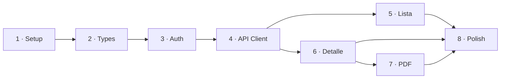

# Pasos de Implementación — Invoice Printer

Basado en [implementation_plan3.md](file:///c:/Users/jeimy/OneDrive/Desktop/Marce/InvoiceGenerator/implementation_plan3.md)

> [!IMPORTANT]
> Cada paso tiene preguntas que **deben responderse antes de implementar ese paso**.
> No avanzamos al siguiente hasta cerrar las preguntas del actual.

---

## Paso 1 · Setup del proyecto

**Qué se hace:**
- `npx create-next-app@latest` con TypeScript, Tailwind v4, App Router
- Instalar dependencias: `@react-pdf/renderer`, `sonner`, `lucide-react`, `clsx`, `tailwind-merge`
- Crear estructura de carpetas vacía (`services/`, `types/`, `lib/`, `config/`, `components/ui/`)
- `.env.example` + `.env.local` con variables base
- `next.config.ts` limpio
- `lib/cn.ts` (utility de classnames)

**Archivos:**
```
package.json, tsconfig.json, next.config.ts,
.env.example, .env.local,
lib/cn.ts
```

### Preguntas — Paso 1

1. **¿Vas a usar shadcn/ui o componentes propios?** shadcn te da table, input, select, button, badge listos. Sin shadcn hay que escribirlos a mano con Tailwind. Para una app de 2 páginas, ambos funcionan — pero shadcn ahorra tiempo en la tabla y los filtros.

2. **¿La app se llama `invoice-printer` como dice el plan, o tiene otro nombre?** Esto define el nombre del directorio y el `name` en `package.json`.

3. **¿Tenés alguna preferencia de package manager?** npm, pnpm, yarn — el plan no lo especifica.

---

## Paso 2 · Types y contrato de API

**Qué se hace:**
- Crear las 4 interfaces TypeScript alineadas con la respuesta real de la API
- `PaginatedResponse<T>`, `Customer`, `Payment`, `Invoice`, `InvoiceItem`, `InvoiceStatus`, `InvoiceFilters`

**Archivos:**
```
types/api.ts
types/customer.ts
types/payment.ts
types/invoice.ts
```

### Preguntas — Paso 2

1. **¿El endpoint `GET /api/v1/invoices` siempre devuelve `customer` embebido o solo `customer_id`?** Si solo devuelve el ID, necesitamos un tercer endpoint (`GET /api/v1/customers/{id}`) y la interface cambia.

2. **¿`payment_method` es siempre un objeto `{ id, name }` o a veces viene como string plano?** El plan lo tipó como unión `{ id: string; name: string } | string` — necesito saber si eso es real o si fue precaución.

3. **¿Los montos (`subtotal`, `total_amount`, etc.) vienen SIEMPRE como strings, o a veces como números?** Esto define si el parseo es obligatorio o defensivo.

4. **¿`subscription_period` y `period_start`/`period_end` de nivel top pueden coexistir en la misma factura?** Necesito saber cuál tiene prioridad para el mapeo al PDF.

---

## Paso 3 · Autenticación y middleware

**Qué se hace:**
- `lib/auth.ts` — leer/escribir cookie `auth_token`
- `lib/tenant.ts` — resolver tenant domain (host del browser en producción, env var en desarrollo)
- `middleware.ts` — redirect a `/login` si no hay token
- `app/login/page.tsx` — login simple (email + password) SI aplica

**Archivos:**
```
lib/auth.ts
lib/tenant.ts
middleware.ts
app/login/page.tsx (condicional)
```

### Preguntas — Paso 3

1. **¿Esta app va a vivir en el mismo dominio/subdominio que `isp-frontend`?**
   - **Mismo dominio** → la cookie `auth_token` ya existe, NO necesitamos login propio. Solo leemos la cookie.
   - **Dominio diferente** → necesitamos pantalla de login + `POST /api/v1/auth/login`. Necesito el contrato de ese endpoint (request body, response shape).

2. **¿La app se va a abrir desde un link dentro de `isp-frontend`?** Si sí, ¿cómo pasa el token? El plan sugiere query param (`?token=xxx`) pero eso tiene riesgos de seguridad (token en logs, historial, Referer). Alternativa más segura: `postMessage` entre ventanas, o fragment hash (`#token=xxx` que no se envía al servidor).

3. **¿El tenant domain es siempre el host del navegador (ej: `demo.ispstart.com`) o puede ser diferente?** ¿Hay casos donde el host sea `app.ejemplo.com` pero el tenant sea `demo.ispstart.com`?

---

## Paso 4 · API Client y Services

**Qué se hace:**
- `services/api-client.ts` — fetch wrapper con auth headers, tenant header, manejo de errores (401 → redirect, parseo de body)
- `services/invoice.service.ts` — `getInvoices()` y `getInvoiceById()`
- `lib/format.ts` — `formatCurrency()`, `formatDate()`

**Archivos:**
```
services/api-client.ts
services/invoice.service.ts
lib/format.ts
```

### Preguntas — Paso 4

1. **¿El API client hace fetch desde el browser (client component) o desde el server (server component/route handler)?** Esto cambia cómo leemos el token y cómo manejamos CORS.
   - **Desde browser**: necesitamos que la API tenga CORS habilitado para nuestro dominio
   - **Desde server**: Next.js hace el fetch y el browser nunca habla directo con la API — más seguro, pero más complejo

2. **¿Qué formato de moneda?** ¿Pesos colombianos (`$101.150`), con decimales (`$101.150,00`), con prefijo `COP`? Esto define `formatCurrency()`.

3. **¿Formato de fechas?** ¿`15/06/2025`, `Jun 15, 2025`, `2025-06-15`? ¿Cuál es la convención que ya usa `isp-frontend`?

---

## Paso 5 · Página de lista (`/invoices`)

**Qué se hace:**
- `app/invoices/page.tsx` — página principal, maneja estado de carga
- `components/invoice-filters.tsx` — input de búsqueda con debounce + select de estado
- `components/invoice-table.tsx` — tabla con columnas, paginación, click en fila → navega a detalle
- `components/invoice-status-badge.tsx` — badge con color por estado
- `app/page.tsx` — redirect a `/invoices`

**Archivos:**
```
app/page.tsx
app/invoices/page.tsx
components/invoice-filters.tsx
components/invoice-table.tsx
components/invoice-status-badge.tsx
```

### Preguntas — Paso 5

1. **¿Cuántas facturas se esperan por tenant?** ¿Decenas, cientos, miles? Esto define si la paginación de 10 por página es suficiente o si necesitamos `per_page` configurable.

2. **¿Qué columnas quieren en la tabla?** El plan propone: #, Cliente, Fecha, Vencimiento, Total, Estado, Acciones. ¿Falta algo? ¿Sobra algo? ¿"Acciones" es solo un botón de "Ver" o hay más?

3. **¿El filtro de búsqueda busca por qué campos?** ¿Nombre del cliente, número de factura, ambos? Esto lo resuelve el backend con `filter[search]`, pero necesito saber qué decirle al usuario en el placeholder.

4. **¿Debounce de cuántos ms en el campo de búsqueda?** El estándar es 300-500ms. ¿Tienen preferencia?

---

## Paso 6 · Página de detalle (`/invoices/[id]`)

**Qué se hace:**
- `app/invoices/[id]/page.tsx` — carga la factura por ID, muestra detalle
- `components/invoice-detail-card.tsx` — card con todos los datos (cliente, fechas, ítems, totales, pagos)
- `config/company.ts` — datos de la empresa para el encabezado del PDF
- `lib/invoice-mapper.ts` — `mapInvoiceToPdfData()` transformación API → PDF

**Archivos:**
```
app/invoices/[id]/page.tsx
components/invoice-detail-card.tsx
config/company.ts
lib/invoice-mapper.ts
```

### Preguntas — Paso 6

1. **¿Los datos de la empresa (nombre, NIT, dirección, teléfono) son fijos para todos los tenants o dependen del tenant?** Si dependen del tenant, ¿hay un endpoint tipo `GET /api/v1/company` o `GET /api/v1/tenant/profile`?

2. **¿Qué datos debe mostrar el detalle?** El plan lista: cliente, fechas, ítems (tabla), totales, pagos. ¿Se muestra también: período de facturación, número de notificaciones, fecha de creación?

3. **¿Los pagos se muestran como lista en el detalle o solo el resumen (total pagado / saldo pendiente)?**

---

## Paso 7 · PDF, Preview e Impresión

**Qué se hace:**
- `components/invoice-pdf-document.tsx` — componente `@react-pdf/renderer` (layout completo del PDF)
- `components/invoice-preview.tsx` — `PDFViewer` embebido con `dynamic({ ssr: false })`
- `components/invoice-print-button.tsx` — genera blob, abre nueva pestaña

**Archivos:**
```
components/invoice-pdf-document.tsx
components/invoice-preview.tsx
components/invoice-print-button.tsx
```

> [!CAUTION]
> Este es el paso más complejo y donde se concentra ~40% del esfuerzo total.
> Las preguntas de este paso son **bloqueantes** — sin respuestas claras, el PDF se rehace.

### Preguntas — Paso 7

1. **¿El formato del PDF es recibo térmico (~75mm de ancho, tipo POS/punto de venta) o página completa (carta/A4)?** Esto cambia RADICALMENTE el layout:
   - **Térmico**: scroll vertical, fuentes pequeñas, sin márgenes, ancho fijo ~58-80mm
   - **Carta/A4**: layout con márgenes, secciones, tablas con espacio

2. **¿Tenés un ejemplo del formato actual que usa `isp-frontend`?** Un screenshot o PDF de ejemplo me ahorra horas de iteración. Si podés compartirlo, ideal.

3. **¿El PDF debe incluir logo de la empresa?** Si sí, ¿de dónde se obtiene? ¿Archivo estático, URL del tenant, env var?

4. **¿Querés preview embebido en la página de detalle (como dice el plan) o solo el botón de imprimir?** El `PDFViewer` embebido agrega complejidad (iframe, carga lenta en mobile). Un enfoque más liviano: solo botón "Imprimir" que genera el PDF y abre pestaña.

5. **Alternativa a considerar: ¿`window.print()` con CSS `@media print` en vez de `@react-pdf/renderer`?**
   - **`@react-pdf/renderer`**: PDF real, pixel-perfect, funciona offline, pero es un framework completo con sus propias primitivas (`<View>`, `<Text>` — NO es HTML)
   - **CSS print**: usamos los mismos componentes React/HTML, solo agregamos estilos de impresión. Más simple, menos control, puede variar entre navegadores
   - Para una app interna de ISP, CSS print puede ser suficiente y es 3x más rápido de implementar

---

## Paso 8 · Polish y edge cases

**Qué se hace:**
- Estados vacíos (sin facturas, sin resultados de búsqueda)
- Error boundaries (API caída, 500, timeout)
- Loading skeletons
- Responsive (¿se usa en mobile?)
- Toasts de error con `sonner`

**Archivos:**
```
components/ui/empty-state.tsx
components/ui/error-boundary.tsx
components/ui/skeleton.tsx (si aplica)
app/layout.tsx (Toaster provider)
```

### Preguntas — Paso 8

1. **¿Esta app se va a usar desde mobile/tablet o solo desde desktop?** Si es mobile, la tabla necesita un diseño alternativo (cards en vez de tabla, o tabla con scroll horizontal).

2. **¿Hay algún branding específico?** Colores, fuentes, logo en el header de la app (NO del PDF — eso es paso 7).

3. **¿Necesita un header/navbar o es full-screen la tabla?** ¿Botón de logout? ¿Nombre del usuario logueado?

---

## Orden de ejecución



> [!NOTE]
> Los pasos 5 y 6 son independientes entre sí (se pueden hacer en paralelo).
> El paso 7 depende del 6 porque necesita los datos del detalle.
> El paso 8 se aplica sobre todo lo anterior.
