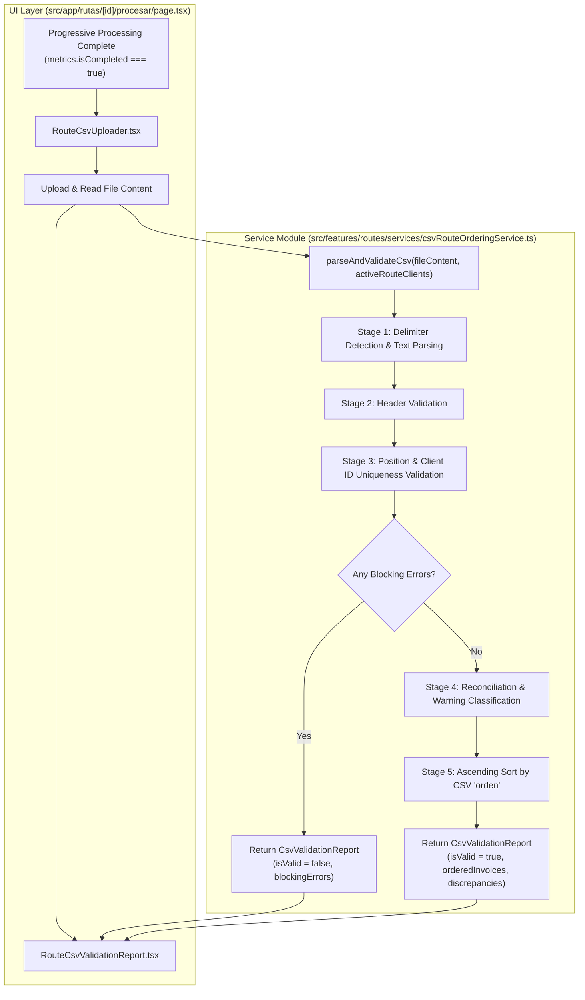

# Design Document: CSV Route Invoice Ordering (`csv-route-ordering`)

## 1. Executive Summary & Architecture Overview

The `csv-route-ordering` feature introduces post-processing CSV file parsing, strict multi-stage validation, discrepancy classification, and invoice reordering to the route execution workflow.

After progressive route processing finishes (`metrics.isCompleted === true`), users can upload a CSV file containing `id_cliente` and `orden`. The system validates the CSV structure, isolates blocking errors from non-blocking warnings, reconciles client entries against active route results (`status === 'success'`), and generates a numerically ordered client invoice list.



---

## 2. Service Module Design

**Target File**: `src/features/routes/services/csvRouteOrderingService.ts`

### 2.1 Explicit TypeScript Interfaces & Types

```typescript
import type { InvoiceFromApi } from '@/features/invoices/types';
import type { RouteClientProcessingState } from '@/app/rutas/[id]/procesar/page';

/**
 * Parsed raw CSV row representation prior to type coercion and business validation.
 */
export interface CsvRowRaw {
  id_cliente: string;
  orden: string;
  lineNumber: number;
}

/**
 * Classification of blocking error codes that prevent ordered invoice generation.
 */
export type CsvBlockingErrorCode =
  | 'INVALID_FORMAT'
  | 'MISSING_HEADERS'
  | 'INVALID_POSITION'
  | 'DUPLICATE_CLIENT_ID';

/**
 * Detailed error object for blocking issues found in CSV parsing/validation.
 */
export interface CsvValidationError {
  code: CsvBlockingErrorCode;
  message: string;
  line?: number;
  details?: string;
}

/**
 * Classification of non-blocking warning codes.
 */
export type CsvWarningCode =
  | 'CLIENT_WITHOUT_INVOICE'
  | 'ROUTE_INVOICE_NOT_IN_CSV';

/**
 * Individual warning record detailing non-blocking discrepancies.
 */
export interface CsvWarning {
  code: CsvWarningCode;
  clientId: string;
  message: string;
  orden?: number;
}

/**
 * Discrepancy summary containing categorized non-blocking warnings.
 */
export interface CsvDiscrepancies {
  clientsWithoutInvoiceInRoute: CsvWarning[];
  routeClientsNotInCsv: CsvWarning[];
}

/**
 * Invoice container for a client matched in CSV, ordered by position.
 */
export interface OrderedClientInvoices {
  orden: number;
  clientId: string;
  invoices: InvoiceFromApi[];
  totalAmount: number;
}

/**
 * Complete report returned by parseAndValidateCsv.
 */
export interface CsvValidationReport {
  isValid: boolean;
  blockingErrors: CsvValidationError[];
  discrepancies: CsvDiscrepancies;
  orderedInvoices: OrderedClientInvoices[];
}
```

### 2.2 Pure Functions & Business Logic

#### 1. Delimiter Detection (`detectDelimiter`)
```typescript
/**
 * Automatically detects whether comma (,) or semicolon (;) is used as delimiter.
 */
export function detectDelimiter(headerLine: string): string {
  const commaCount = (headerLine.match(/,/g) || []).length;
  const semicolonCount = (headerLine.match(/;/g) || []).length;
  return semicolonCount > commaCount ? ';' : ',';
}
```

#### 2. Raw File Parsing (`parseCsvText`)
```typescript
/**
 * Splits raw CSV file text into normalized lines, extracts headers, and parses raw rows.
 */
export function parseCsvText(fileContent: string): {
  headers: string[];
  rows: CsvRowRaw[];
  error?: CsvValidationError;
} {
  if (!fileContent || !fileContent.trim()) {
    return {
      headers: [],
      rows: [],
      error: {
        code: 'INVALID_FORMAT',
        message: 'El archivo CSV está vacío o no contiene texto legible.',
      },
    };
  }

  const lines = fileContent
    .split(/\r?\n/)
    .map((line) => line.trim())
    .filter((line) => line.length > 0);

  if (lines.length === 0) {
    return {
      headers: [],
      rows: [],
      error: {
        code: 'INVALID_FORMAT',
        message: 'El archivo CSV no contiene líneas válidas.',
      },
    };
  }

  const delimiter = detectDelimiter(lines[0]);
  const rawHeaders = lines[0].split(delimiter).map((h) => h.trim().toLowerCase());

  const rows: CsvRowRaw[] = [];
  for (let i = 1; i < lines.length; i++) {
    const parts = lines[i].split(delimiter).map((p) => p.trim());
    const idIndex = rawHeaders.indexOf('id_cliente');
    const ordenIndex = rawHeaders.indexOf('orden');

    rows.push({
      id_cliente: idIndex !== -1 && parts[idIndex] !== undefined ? parts[idIndex] : '',
      orden: ordenIndex !== -1 && parts[ordenIndex] !== undefined ? parts[ordenIndex] : '',
      lineNumber: i + 1,
    });
  }

  return { headers: rawHeaders, rows };
}
```

#### 3. Header Validation (`validateHeaders`)
```typescript
/**
 * Validates that required headers 'id_cliente' and 'orden' are present.
 */
export function validateHeaders(headers: string[]): CsvValidationError | null {
  const hasIdCliente = headers.includes('id_cliente');
  const hasOrden = headers.includes('orden');

  if (!hasIdCliente || !hasOrden) {
    const missing = [];
    if (!hasIdCliente) missing.push("'id_cliente'");
    if (!hasOrden) missing.push("'orden'");
    return {
      code: 'MISSING_HEADERS',
      message: `El archivo CSV no contiene los encabezados obligatorios: ${missing.join(', ')}.`,
      details: `Encabezados detectados: ${headers.join(', ') || 'ninguno'}.`,
    };
  }

  return null;
}
```

#### 4. Row & Position Validation (`validateAndParseRows`)
```typescript
/**
 * Validates row positions (numeric positive integer > 0) and unique client IDs.
 */
export function validateAndParseRows(rows: CsvRowRaw[]): {
  validRows: Array<{ clientId: string; orden: number; lineNumber: number }>;
  blockingErrors: CsvValidationError[];
} {
  const blockingErrors: CsvValidationError[] = [];
  const validRows: Array<{ clientId: string; orden: number; lineNumber: number }> = [];
  const seenClientIds = new Set<string>();

  for (const row of rows) {
    const cleanClientId = row.id_cliente.trim();
    const cleanOrdenStr = row.orden.trim();

    if (!cleanClientId) {
      blockingErrors.push({
        code: 'INVALID_FORMAT',
        message: `Fila ${row.lineNumber}: El campo 'id_cliente' está vacío.`,
        line: row.lineNumber,
      });
      continue;
    }

    // Check duplicate client ID in CSV
    if (seenClientIds.has(cleanClientId)) {
      blockingErrors.push({
        code: 'DUPLICATE_CLIENT_ID',
        message: `Fila ${row.lineNumber}: El id_cliente '${cleanClientId}' está duplicado en el archivo CSV.`,
        line: row.lineNumber,
      });
    } else {
      seenClientIds.add(cleanClientId);
    }

    // Validate position ('orden') integer > 0
    const parsedOrden = Number(cleanOrdenStr);
    const isInteger = Number.isInteger(parsedOrden);
    if (!cleanOrdenStr || isNaN(parsedOrden) || !isInteger || parsedOrden <= 0) {
      blockingErrors.push({
        code: 'INVALID_POSITION',
        message: `Fila ${row.lineNumber}: El valor de orden '${cleanOrdenStr}' no es un entero positivo válido (> 0).`,
        line: row.lineNumber,
        details: `Cliente: ${cleanClientId}`,
      });
    } else {
      validRows.push({
        clientId: cleanClientId,
        orden: parsedOrden,
        lineNumber: row.lineNumber,
      });
    }
  }

  return { validRows, blockingErrors };
}
```

#### 5. Main Orchestration Function (`parseAndValidateCsv`)
```typescript
/**
 * Primary entry point for parsing, validating, reconciling, and ordering invoices.
 */
export function parseAndValidateCsv(
  fileContent: string,
  activeRouteClients: RouteClientProcessingState[]
): CsvValidationReport {
  // Step 1: Text parsing
  const { headers, rows, error: parseError } = parseCsvText(fileContent);

  if (parseError) {
    return {
      isValid: false,
      blockingErrors: [parseError],
      discrepancies: { clientsWithoutInvoiceInRoute: [], routeClientsNotInCsv: [] },
      orderedInvoices: [],
    };
  }

  // Step 2: Header checking
  const headerError = validateHeaders(headers);
  if (headerError) {
    return {
      isValid: false,
      blockingErrors: [headerError],
      discrepancies: { clientsWithoutInvoiceInRoute: [], routeClientsNotInCsv: [] },
      orderedInvoices: [],
    };
  }

  // Step 3: Row parsing and position validation
  const { validRows, blockingErrors } = validateAndParseRows(rows);
  if (blockingErrors.length > 0) {
    return {
      isValid: false,
      blockingErrors,
      discrepancies: { clientsWithoutInvoiceInRoute: [], routeClientsNotInCsv: [] },
      orderedInvoices: [],
    };
  }

  // Step 4 & 5: Reconciliation and ascending ordering
  const activeClientsMap = new Map<string, RouteClientProcessingState>();
  activeRouteClients.forEach((client) => {
    activeClientsMap.set(client.clientId, client);
  });

  const matchedCsvClientIds = new Set<string>();
  const orderedInvoices: OrderedClientInvoices[] = [];
  const clientsWithoutInvoiceInRoute: CsvWarning[] = [];

  // Sort CSV rows by orden ascending
  const sortedRows = [...validRows].sort((a, b) => a.orden - b.orden);

  for (const row of sortedRows) {
    const routeClient = activeClientsMap.get(row.clientId);

    if (routeClient && routeClient.status === 'success' && routeClient.invoices.length > 0) {
      matchedCsvClientIds.add(row.clientId);
      const totalAmount = routeClient.invoices.reduce(
        (sum, inv) => sum + (inv.total_amount || 0),
        0
      );
      orderedInvoices.push({
        orden: row.orden,
        clientId: row.clientId,
        invoices: routeClient.invoices,
        totalAmount,
      });
    } else {
      // CSV client has no active invoices in route (empty, error, or unassigned)
      clientsWithoutInvoiceInRoute.push({
        code: 'CLIENT_WITHOUT_INVOICE',
        clientId: row.clientId,
        orden: row.orden,
        message: `El cliente ${row.clientId} (Orden ${row.orden}) fue incluido en el CSV pero no tiene facturas activas en la ruta.`,
      });
    }
  }

  // Identify active route clients not listed in CSV
  const routeClientsNotInCsv: CsvWarning[] = [];
  activeRouteClients.forEach((client) => {
    if (client.status === 'success' && client.invoices.length > 0 && !matchedCsvClientIds.has(client.clientId)) {
      routeClientsNotInCsv.push({
        code: 'ROUTE_INVOICE_NOT_IN_CSV',
        clientId: client.clientId,
        message: `El cliente ${client.clientId} tiene facturas emitidas activas en la ruta pero no fue incluido en el CSV.`,
      });
    }
  });

  return {
    isValid: true,
    blockingErrors: [],
    discrepancies: {
      clientsWithoutInvoiceInRoute,
      routeClientsNotInCsv,
    },
    orderedInvoices,
  };
}
```

---

## 3. UI Component Designs

### 3.1 `RouteCsvUploader.tsx`

**Target File**: `src/features/routes/components/RouteCsvUploader.tsx`

#### Props Interface
```typescript
export interface RouteCsvUploaderProps {
  isCompleted: boolean;
  onFileSelected: (fileContent: string, fileName: string) => void;
  onReset?: () => void;
  disabled?: boolean;
}
```

#### Visual Layout & State Design
- **Unlocked State (`isCompleted === true`)**:
  - Displays a drop zone card with `Upload`, `FileText`, and `CheckCircle2` icons.
  - Accepts `.csv` files via native `<input type="file" accept=".csv,text/csv" />`.
  - Employs `FileReader` API (`readAsText`) to read contents.
  - Indicates selected file name and size with a "Cambiar Archivo" or "Quitar" button.
- **Locked State (`isCompleted === false`)**:
  - Disabled file input container with grayed-out UI and `Lock` icon.
  - Tooltip or helper text: *"El ordenamiento por CSV se habilitará una vez finalizado el procesamiento de la ruta."*

---

### 3.2 `RouteCsvValidationReport.tsx`

**Target File**: `src/features/routes/components/RouteCsvValidationReport.tsx`

#### Props Interface
```typescript
export interface RouteCsvValidationReportProps {
  report: CsvValidationReport;
  fileName: string;
  onClear?: () => void;
}
```

#### Visual Layout & Section Breakdown

1. **Blocking Error State (`report.isValid === false`)**:
   - Banners rendered using `Card` with `border-destructive/40 bg-destructive/5`.
   - Header badge: `Error de Validación CSV`.
   - List of blocking errors detailing line numbers, error code tags (`INVALID_POSITION`, `MISSING_HEADERS`, etc.), and diagnostic error text.
   - Ordered invoices table is **suppressed**.

2. **Valid / Warning State (`report.isValid === true`)**:
   - **Status Badge**:
     - Green `"Validación Completada"` if zero warnings exist.
     - Amber/Yellow `"Validación con Advertencias"` if discrepancy warnings are present.
   - **Metrics Bar**:
     - Total Invoices Ordered
     - Total Matched Clients
     - Total Grand Amount (COP Currency)
   - **Discrepancy Warning Cards**:
     - *CSV Clients Without Invoices*: Renders amber badge alerts listing `clientId` and specified `orden`.
     - *Active Route Clients Missing From CSV*: Renders slate/warning alerts listing omitted `clientId`s.
   - **Ordered Invoices Data Table**:
     - Columns: `Orden (CSV)`, `ID Cliente`, `Facturas Emitidas`, `Fecha Emisión`, `Monto Total`.
     - Sorted strictly by `orden` in ascending numerical order.

---

## 4. Integration Details into `page.tsx`

**Target File**: `src/app/rutas/[id]/procesar/page.tsx`

### 4.1 State Management Updates
```typescript
// New imports in page.tsx
import { RouteCsvUploader } from '@/features/routes/components/RouteCsvUploader';
import { RouteCsvValidationReport } from '@/features/routes/components/RouteCsvValidationReport';
import { parseAndValidateCsv, type CsvValidationReport } from '@/features/routes/services/csvRouteOrderingService';

// Additional page state hooks inside BatchProcessRoutePage component
const [csvReport, setCsvReport] = useState<CsvValidationReport | null>(null);
const [csvFileName, setCsvFileName] = useState<string | null>(null);

// Handler for CSV file upload selection
const handleCsvFileSelected = (fileContent: string, fileName: string) => {
  setCsvFileName(fileName);
  const report = parseAndValidateCsv(fileContent, clientStates);
  setCsvReport(report);
};

// Reset handler when restarting progressive processing
const handleResetCsv = () => {
  setCsvReport(null);
  setCsvFileName(null);
};
```

### 4.2 Page Layout & Insertion Point
The CSV Ordering section is rendered immediately after the **Real-Time Per-Client Status Feed Table**:

```tsx
{/* Existing Real-Time Per-Client Status Feed Table Card */}
<Card className="shadow-sm">...</Card>

{/* Section: Post-Processing CSV Route Ordering */}
<div className="space-y-6 pt-4">
  <div className="border-t pt-6">
    <h2 className="text-xl font-bold tracking-tight mb-1">
      Ordenamiento Personalizado por CSV
    </h2>
    <p className="text-sm text-muted-foreground mb-4">
      Cargue un archivo CSV para establecer el orden numérico de facturación para la ruta procesada.
    </p>
  </div>

  <RouteCsvUploader
    isCompleted={metrics.isCompleted}
    onFileSelected={handleCsvFileSelected}
    onReset={handleResetCsv}
    disabled={metrics.isRunning}
  />

  {csvReport && csvFileName && (
    <RouteCsvValidationReport
      report={csvReport}
      fileName={csvFileName}
      onClear={handleResetCsv}
    />
  )}
</div>
```

---

## 5. Verification Plan & Test Strategy

### 5.1 Unit Testing Strategy (`csvRouteOrderingService.test.ts`)
- **Header Parsing**: Test comma `,` and semicolon `;` header extraction; verify missing header detection.
- **Position Rules**: Test valid non-contiguous sequences (`1, 5, 12`); verify rejection of zero, negative, floating point, and non-numeric values.
- **Client Uniqueness**: Verify detection and blocking error generation for duplicate `id_cliente` rows.
- **Discrepancies**: Test warning generation for CSV clients without active invoices and active route clients missing from CSV.
- **Sorting Accuracy**: Verify that output list is ordered strictly ascending by CSV `orden`.

### 5.2 End-to-End Visual Verification
- Verify that the CSV uploader remains disabled during progressive route processing and unlocks upon completion.
- Upload valid and invalid CSV samples to verify error/warning banner rendering and ordered invoice output.
