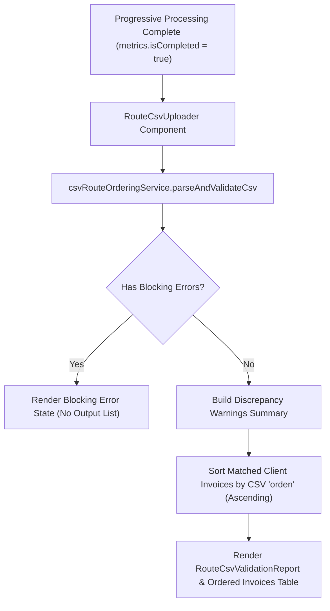

# Change Proposal: CSV Route Invoice Ordering (`csv-route-ordering`)

## 1. Intent & Scope

### 1.1 Intent
The goal of this change is to enable post-processing custom sorting of route invoices using an uploaded CSV file. Once progressive batch processing for a route is completed, users can upload a CSV file specifying custom customer sequence numbers (`orden`). The system validates the CSV structure, identifies errors or discrepancies, and produces a numerically ordered invoice list for matched clients.

### 1.2 Scope
- **In Scope**:
  - Unlocking CSV upload functionality only after progressive route processing finishes (`metrics.isCompleted === true`).
  - Strict header parsing requiring `id_cliente` and `orden`.
  - Comprehensive classification of validation feedback into **Blocking Errors** and **Warnings**.
  - Reconciliation of CSV entries against clients with active invoices (`status === 'success'`).
  - Outputting a sorted list of invoices ordered by CSV `orden` (ascending numeric order).
  - UI components for file upload and structured validation/discrepancy reporting.

- **Out of Scope**:
  - Drag-and-drop manual UI reordering.
  - PDF generation or direct file exports.
  - Altering or refactoring the progressive batch query execution loop.

---

## 2. User Definitions & Validation Policy

### 2.1 Expected CSV Format
- **Headers**: Mandatory headers `id_cliente,orden` (case-insensitive trimming permitted).
- **Row Format**:
  ```csv
  id_cliente,orden
  10001,1
  10025,2
  10042,5
  ```
- **Ordering Rule**: `orden` must be a positive integer (\(> 0\)) and unique per client entry within the CSV. Sorting is performed in **numeric ascending order**. Strict contiguousness is **not** required (e.g., sequence `1, 3, 5` is valid).

### 2.2 Validation Policy: Blocking Errors vs. Warnings

| Classification | Condition / Event | System Behavior |
| :--- | :--- | :--- |
| **BLOCKING ERROR** | Invalid file format or non-CSV file extension | Halts processing; displays error alert. No ordered invoice list is generated. |
| **BLOCKING ERROR** | Missing required headers (`id_cliente` or `orden`) | Halts processing; displays structural header error. |
| **BLOCKING ERROR** | Duplicate `id_cliente` entries in the CSV file | Halts processing; lists duplicate client IDs. |
| **BLOCKING ERROR** | Invalid `orden` values (non-numeric, floating point, or \(\le 0\)) | Halts processing; specifies invalid row(s) and line number(s). |
| **WARNING** | CSV client ID has no active invoices in route (`empty`, `error`, or unassigned) | Non-blocking. Reported in discrepancy summary; skipped during invoice ordering. |
| **WARNING** | Active route client (`status === 'success'`) not listed in CSV file | Non-blocking. Reported in discrepancy summary; excluded from CSV-ordered output list. |

*Note*: When only Warnings are present, the system generates and displays the ordered invoice list for all matched clients.

### 2.3 Progressive Status Verification
- In `RouteClientProcessingState`, `status === 'success'` designates a client with active invoices found (`invoices.length > 0`).
- The existing progressive query execution loop in `src/app/rutas/[id]/procesar/page.tsx` is left **completely unaltered**.
- Reconciliation matches CSV `id_cliente` entries strictly against states where `status === 'success'`.

---

## 3. Capabilities

### New Capability: `csv-route-ordering`
- **Description**: Provides post-processing CSV file upload, structural validation (blocking vs. warning rules), discrepancy reconciliation against route execution results, and numeric ascending sorting of client invoices.

---

## 4. Approach & Affected Areas

### 4.1 Architecture Overview
The implementation is separated into modular service and UI layers:



### 4.2 Affected Areas
- **New Service File**: `src/features/routes/services/csvRouteOrderingService.ts`
  - Handles text parsing, delimiter detection (comma/semicolon), header checking, blocking validation, warning categorization, and invoice sorting.
- **New UI Components**:
  - `src/features/routes/components/RouteCsvUploader.tsx`: File input UI component.
  - `src/features/routes/components/RouteCsvValidationReport.tsx`: Displays blocking errors, warning cards, discrepancy lists, and the ordered invoices table.
- **Page Integration**:
  - `src/app/rutas/[id]/procesar/page.tsx`: Render CSV uploader section conditionally after `metrics.isCompleted === true`.

---

## 5. Risks, Rollback Plan & Success Criteria

### 5.1 Risks
1. **Delimiter Variations**: Users submitting CSVs with semicolons or tabs instead of standard commas.
   - *Mitigation*: Service detects common delimiters automatically while verifying headers.
2. **String vs. Numeric Client IDs**: Leading zeros or formatted string client IDs.
   - *Mitigation*: Trim whitespace and normalize client ID strings before matching against `clientId` in `RouteClientProcessingState`.

### 5.2 Rollback Plan
- Revert additions in `src/app/rutas/[id]/procesar/page.tsx` or conditionally disable the `RouteCsvUploader` component. Since progressive route execution logic is unaffected, core route processing will remain 100% operational.

### 5.3 Success Criteria
- [ ] Users can upload a CSV file only when progressive route processing is completed.
- [ ] Structural errors (missing headers, invalid `orden`, duplicates) trigger **Blocking Error** banners and prevent invoice list output.
- [ ] Missing client matches and unlisted active route clients produce clear **Warning** summary cards.
- [ ] Matched invoices are rendered strictly in ascending order according to CSV `orden`.
- [ ] Progressive route execution performance and logic remain fully preserved without regressions.
