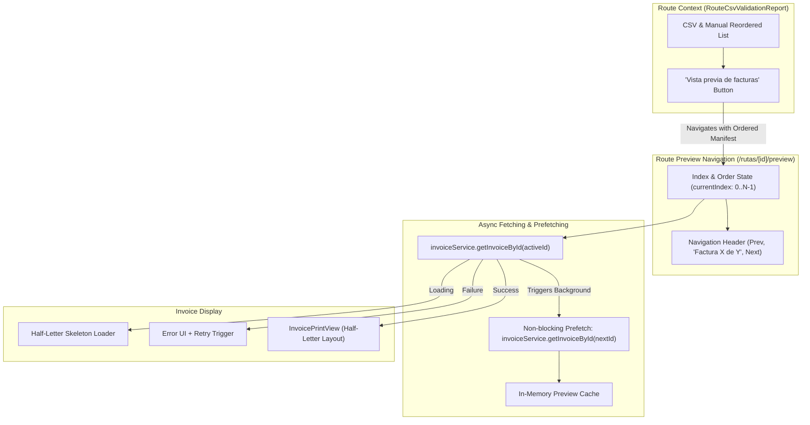

# Technical Design: invoice-preview

## 1. Executive Summary & Architectural Overview

The `invoice-preview` change introduces a dedicated full-page batch invoice preview system and adapts the invoice rendering engine for Half-Letter format (`5.5 in x 8.5 in` / `140 mm x 216 mm`). 

This architecture allows operational users to visually inspect invoices in the exact order generated by CSV validation and manual drag-and-drop adjustments before future PDF compilation or batch physical printing.



---

## 2. Technical Architecture & File Structure

### 2.1 File Map

| File Path | Role / Purpose |
| --- | --- |
| `src/features/routes/components/RouteCsvValidationReport.tsx` | Entry point. Adds the `"Vista previa de facturas"` trigger button and serializes/passes ordered invoice manifests. |
| `src/app/rutas/[id]/preview/page.tsx` | Next.js Page route component for `/rutas/[id]/preview`. Retrieves parameters and mounts `InvoiceRoutePreviewView`. |
| `src/features/routes/components/InvoiceRoutePreviewView.tsx` | Main container component managing `currentIndex`, state machines (loading, error, prefetching cache), and top navigation toolbar. |
| `src/features/invoices/components/InvoicePrintView.tsx` | Component standardizing `InvoiceDetailPrint` layout inside a strict Half-Letter container (`5.5in x 8.5in` / `140mm x 216mm`). |
| `src/features/invoices/components/InvoiceDetailPrint.tsx` | Refactored/adapted layout engine providing Half-Letter CSS rules and print page isolation. |
| `src/features/invoices/types.ts` | Data structures for `BatchPrintManifest`, `InvoicePreviewState`, and navigation contracts. |

---

## 3. Detailed Component & Integration Design

### 3.1 Entry Point: `RouteCsvValidationReport`

- **Location**: [RouteCsvValidationReport.tsx](file:///c:/Users/jeimy/OneDrive/Desktop/Marce/InvoiceGenerator/src/features/routes/components/RouteCsvValidationReport.tsx)
- **Behavior**:
  - Extracts the flattened sequence of `invoiceId` items from `orderedClients` (respecting both CSV order and manual drag-and-drop adjustments).
  - Displays a prominent **"Vista previa de facturas"** button in the header toolbar when `report.isValid` is true.
  - On click, navigates to `/rutas/[id]/preview` passing the ordered invoice IDs via URL query parameter or sessionStorage/state manifest.

```typescript
// Flattening ordered invoices from report state
const orderedInvoiceIds = orderedClients.flatMap(client => client.invoices.map(inv => inv.id));
```

---

### 3.2 View & Container: `InvoiceRoutePreviewView`

- **Location**: `src/features/routes/components/InvoiceRoutePreviewView.tsx`
- **Route**: `src/app/rutas/[id]/preview/page.tsx`
- **Responsibilities**:
  1. **Index Tracking**: Manages `currentIndex` (`0` to `N - 1`).
  2. **Boundary Controls**:
     - Prev button (`Anterior`): `disabled = currentIndex === 0 || isLoading`.
     - Next button (`Siguiente`): `disabled = currentIndex === N - 1 || isLoading`.
     - Status Indicator: Displays `"Factura ${currentIndex + 1} de ${totalInvoices}"`.
  3. **Async Data Fetching**:
     - Calls `invoiceService.getInvoiceById(currentInvoiceId)`.
     - Maintains internal cache `Record<string, InvoiceFromApi>` to prevent duplicate requests.
  4. **Non-blocking Prefetching**:
     - Once `currentIndex` fetch succeeds, triggers `invoiceService.getInvoiceById(nextInvoiceId)` for `currentIndex + 1` silently if `currentIndex + 1 < N` and `!cache[nextInvoiceId]`.
  5. **States Handled**:
     - **Initial / Transition Loading**: Displays skeleton loader matching Half-Letter dimensions.
     - **Error State**: Displays error prompt with an inline `"Reintentar"` (Retry) button.
     - **Empty List State**: Displays informative fallback if no invoices are present in the batch.

---

### 3.3 Print View & Layout Isolation: `InvoicePrintView`

- **Location**: `src/features/invoices/components/InvoicePrintView.tsx` (wrapping [InvoiceDetailPrint.tsx](file:///c:/Users/jeimy/OneDrive/Desktop/Marce/InvoiceGenerator/src/features/invoices/components/InvoiceDetailPrint.tsx))
- **Layout Specifications**:
  - **Dimensions**: Standard Half-Letter dimensions (`5.5 in` width x `8.5 in` height / `140 mm` x `216 mm`).
  - **CSS Dimensions**: `w-[5.5in] h-[8.5in]` or `min-w-[140mm] max-w-[140mm] min-h-[216mm]`.
  - **CSS `@page` Definition**:
    ```css
    @media print {
      @page {
        size: 5.5in 8.5in;
        margin: 5mm;
      }
      body {
        margin: 0;
        padding: 0;
        background: #ffffff;
      }
      .half-letter-page {
        page-break-after: always;
        break-after: page;
      }
    }
    ```
- **Single-Invoice Print Button**: Omitted in preview mode as per requirements (PDF generation and `window.print` execution are deferred).

---

## 4. Data Contracts & State Management

### 4.1 Manifest & Preview Types (`src/features/invoices/types.ts`)

```typescript
export interface BatchPrintManifest {
  routeId: string;
  invoiceIds: string[];
  totalCount: number;
  generatedAt: string;
}

export interface InvoicePreviewState {
  currentIndex: number;
  totalInvoices: number;
  activeInvoice: InvoiceFromApi | null;
  status: 'idle' | 'loading' | 'success' | 'error';
  error: string | null;
  cache: Record<string, InvoiceFromApi>;
}
```

---

## 5. Non-Goals & Deferred Work

1. **PDF Engine Execution**: Deferred to a subsequent step.
2. **Direct Browser Print (`window.print`)**: Deferred to batch action phase.
3. **CSV Reordering Modifications**: Handled upstream by `csvRouteOrderingService.ts`.

---

## 6. Risk Assessment & Mitigations

| Risk | Level | Mitigation Strategy |
| --- | --- | --- |
| Content overflow on Half-Letter paper | High | Strict font scaling (`text-[10px]` / `text-[11px]`), tight padding (`p-3`), and fixed table layout to ensure single-page fit. |
| URL length limit when passing many invoice IDs | Medium | Use `sessionStorage` fallback for large manifest lists while using index queries `?index=k` in URL. |
| Unhandled API failure during prefetching | Low | Catch prefetch errors silently so background errors do not disrupt the user's active invoice view. |
