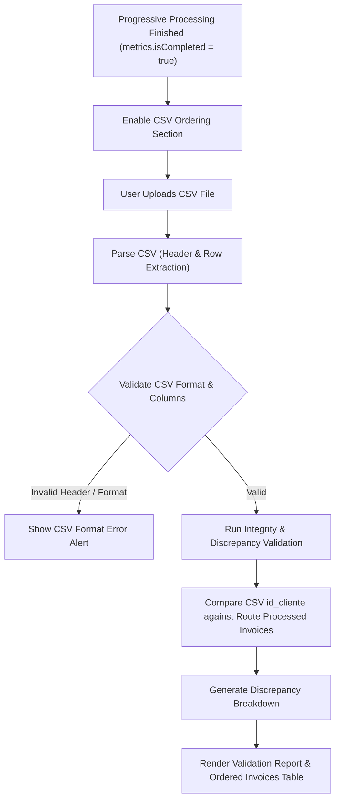

# Exploration Report: CSV Route Invoice Ordering (`csv-route-ordering`)

## 1. Executive Summary

This report documents the exploration of the InvoiceGenerator codebase to design a **CSV Upload and Validation module for Route Invoice Ordering** after progressive batch route processing completes.

Currently, `src/app/rutas/[id]/procesar/page.tsx` executes progressive queries for all clients assigned to a route, building live status indicators and accumulating retrieved active invoices (`InvoiceFromApi[]`) for each client.

The `csv-route-ordering` change introduces a post-processing phase: once progressive execution completes (`metrics.isCompleted === true`), the user can upload a CSV file specifying custom customer ordering (`id_cliente`, position/order). The system validates CSV format and integrity, reconciles CSV client IDs against clients with retrieved invoices, reports discrepancies, and outputs a sorted invoice list matching the CSV sequence.

---

## 2. Codebase Inspection & Current Processing Model

### 2.1 Key Source Files Analyzed

- **[src/app/rutas/[id]/procesar/page.tsx](file:///c:/Users/jeimy/OneDrive/Desktop/Marce/InvoiceGenerator/src/app/rutas/%5Bid%5D/procesar/page.tsx)**:
  - Manages batch execution for route clients.
  - Maintains `clientStates: RouteClientProcessingState[]` containing `{ clientId, status: 'pending' | 'processing' | 'success' | 'empty' | 'error', invoices: InvoiceFromApi[], error?: string }`.
  - Tracks `metrics: RouteProcessingMetrics` with flags `isRunning` and `isCompleted`.
  - **Constraint Requirement**: This sequential query execution loop (`startProcessing`) must remain untouched.

- **[src/types/ruta.ts](file:///c:/Users/jeimy/OneDrive/Desktop/Marce/InvoiceGenerator/src/types/ruta.ts)**:
  - Route domain interfaces: `RouteRow`, `RouteClientRow`, `RouteWithClients`.

- **[src/features/invoices/types/index.ts](file:///c:/Users/jeimy/OneDrive/Desktop/Marce/InvoiceGenerator/src/features/invoices/types/index.ts)**:
  - `InvoiceFromApi`: Includes `id`, `customer_id`, `total_amount`, `issue_date`, `due_date`, `status`.

- **[src/lib/rutas-utils.ts](file:///c:/Users/jeimy/OneDrive/Desktop/Marce/InvoiceGenerator/src/lib/rutas-utils.ts)**:
  - Contains helper `parseAndCleanClientIds` for sanitizing client IDs.

---

## 3. Post-Processing Integration Workflow

The CSV ordering step strictly follows progressive processing completion. The diagram below details the integration flow:



---

## 4. Requirements & Technical Specification

### 4.1 CSV Format & Field Requirements

- **Minimum Required Columns**:
  - `id_cliente` (or alias: `cliente_id`, `client_id`, `id`): Client identification string.
  - `posicion` (or alias: `orden`, `order`, `pos`, `secuencia`, `rank`): Numeric index representing desired sequence. If omitted, line order (1-based index) can serve as fallback or generate a warning.
- **Delimiter Support**: Accepts comma (`,`) or semicolon (`;`), strips quotes and whitespace.

### 4.2 Validation Logic & Integrity Checks

1. **Format Validation**:
   - File extension (`.csv` or text file).
   - Empty file or unparseable headers.
   - Header presence for `id_cliente` and position column.
2. **Row & Value Validations**:
   - **Invalid Rows**: Missing or empty `id_cliente`, or non-numeric/negative position value.
   - **Duplicate Clients**: Same `id_cliente` appearing multiple times in the CSV file.
3. **Reconciliation against Progressive Route Results**:
   - **CSV clients without invoice**: `id_cliente` listed in CSV, but progressive processing returned `empty`, `error`, or client was not in the route.
   - **Route invoices/clients not in CSV**: Clients that progressive processing found active invoices for (`status === 'success'`), but are missing from the CSV.
   - **Duplicate or invalid clients in CSV**: Highlighted specifically in the validation report.

### 4.3 Output Generation

- When validation runs, produce a sorted list of invoices:
  - Filter `clientStates` where `status === 'success'` and `invoices.length > 0`.
  - Order client invoice sets according to the position values specified in the CSV.
  - Each item in the ordered output maps `position`, `id_cliente`, and `invoices: InvoiceFromApi[]`.

---

## 5. Proposed Component & Service Architecture

To keep code clean and modular without modifying progressive processing logic, we propose creating dedicated modules:

### 5.1 Service Layer: `src/features/routes/services/csvRouteOrderingService.ts`

```typescript
export interface CsvRowRaw {
  id_cliente: string;
  posicion: number;
  rawLine: number;
}

export interface CsvValidationError {
  row: number;
  clientId?: string;
  type: 'MISSING_CLIENT_ID' | 'INVALID_POSITION' | 'DUPLICATE_CLIENT';
  message: string;
}

export interface CsvDiscrepancies {
  csvClientsWithoutInvoices: string[]; // In CSV, but no invoice found in route
  routeClientsNotInCsv: string[];      // Has invoice in route, missing from CSV
  duplicateClientsInCsv: string[];     // Repeated id_cliente in CSV
  invalidRows: CsvValidationError[];   // Malformed rows
}

export interface OrderedClientInvoices {
  position: number;
  clientId: string;
  invoices: InvoiceFromApi[];
}

export interface CsvValidationReport {
  isValid: boolean;
  totalCsvRows: number;
  validCsvEntriesCount: number;
  discrepancies: CsvDiscrepancies;
  orderedInvoices: OrderedClientInvoices[];
}
```

### 5.2 UI Components

1. **`src/features/routes/components/RouteCsvUploader.tsx`**:
   - File input element (accept `.csv`).
   - Parses CSV string into raw rows.
   - Triggered only after `metrics.isCompleted` or when invoices are available.

2. **`src/features/routes/components/RouteCsvValidationReport.tsx`**:
   - Summary cards displaying validation state (Success, Warning, Error badges).
   - Accordion / tabbed sections detailing:
     - Discrepancies (CSV clients without invoices, route invoices missing in CSV, duplicates).
     - Ordered Invoice List with client position badges and invoice details.

3. **Page Integration (`src/app/rutas/[id]/procesar/page.tsx`)**:
   - Add state `csvReport: CsvValidationReport | null = null`.
   - Render `RouteCsvUploader` and `RouteCsvValidationReport` below the progressive processing section when `metrics.isCompleted` is true.

---

## 6. Exclusions & Constraints Compliance Check

| Requirement / Constraint | Compliance Status | Strategy |
| :--- | :--- | :--- |
| 1. Upload option post-processing | ✅ Compliant | Unlocked when `metrics.isCompleted === true` |
| 2. CSV minimum fields (`id_cliente`, order) | ✅ Compliant | Flexible column mapping with validation |
| 3. Validations (format, headers, duplicates, invalid) | ✅ Compliant | Robust parsing & error classification |
| 4. Comparison vs progressive route invoices | ✅ Compliant | Reconciled against `clientStates` (`success`) |
| 5. Discrepancy reporting | ✅ Compliant | Categorized reporting of missing & extra items |
| 6. Valid ordered invoice list output | ✅ Compliant | Array ordered by CSV position |
| 7. Visual UI status display | ✅ Compliant | Status badges, metric cards, and report tables |
| 8. Excluded features (drag&drop, preview, PDF) | ✅ Deferred | Explicitly excluded for this change |
| 9. Progressive processing untouched | ✅ Guaranteed | Processing loop & logic unmodified |

---

## 7. Structured Exploration Summary Envelope

```json
{
  "status": "completed",
  "executive_summary": "Explored codebase for CSV route ordering. Designed post-processing CSV upload, validation, discrepancy reconciliation, and ordered invoice output architecture while preserving progressive route processing logic.",
  "artifacts": [
    "openspec/changes/csv-route-ordering/exploration.md"
  ],
  "next_recommended": "Proceed to proposal creation (sdd-proposal) or technical design spec (sdd-design) for csv-route-ordering.",
  "risks": [
    "CSV files with non-standard delimiters (e.g. tab or semicolon) requiring flexible line parsing",
    "Clients with multiple invoices needing sequence assignment per client vs per invoice"
  ]
}
```
