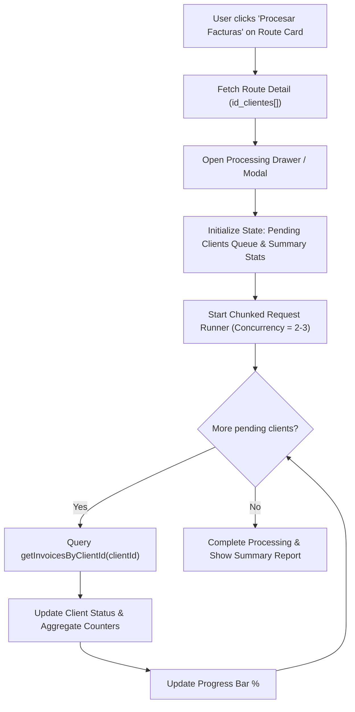

# Exploration Report: Batch Route Invoice Processing UI (`procesar-facturas-ruta-ui`)

## 1. Executive Summary

This report documents the exploration of the InvoiceGenerator codebase to design and implement a progressive, real-time batch invoice processing interface for billing routes (`rutas`). 

The system currently allows managing routes consisting of a list of customer IDs (`id_clientes`). The objective of `procesar-facturas-ruta-ui` is to enable users to trigger a batch invoice query for all customer IDs assigned to a route, showing live progress, status breakdowns per client, summary counters, and error handling.

---

## 2. Codebase & Component Analysis

### 2.1 Existing Route Components & Files
- [src/app/rutas/page.tsx](file:///c:/Users/jeimy/OneDrive/Desktop/Marce/InvoiceGenerator/src/app/rutas/page.tsx): Main routes management page (`RutasPage`). Renders cards for each route, modal for creating/editing routes, and a modal for viewing route clients.
- [src/types/ruta.ts](file:///c:/Users/jeimy/OneDrive/Desktop/Marce/InvoiceGenerator/src/types/ruta.ts): Core TypeScript interfaces:
  - `RouteRow`: Basic DB record (`id`, `nombre`, `created_at`, `updated_at`).
  - `RouteClientRow`: Junction table record (`id`, `route_id`, `client_id`).
  - `RouteWithClients`: Complete route object including `id_clientes: string[]`.
- [src/app/api/rutas/route.ts](file:///c:/Users/jeimy/OneDrive/Desktop/Marce/InvoiceGenerator/src/app/api/rutas/route.ts): Route listing (`GET`) and creation (`POST`).
- [src/app/api/rutas/[id]/route.ts](file:///c:/Users/jeimy/OneDrive/Desktop/Marce/InvoiceGenerator/src/app/api/rutas/%5Bid%5D/route.ts): Detail query (`GET`), update (`PUT`), and deletion (`DELETE`).

### 2.2 Invoice Service Integration
- [src/features/invoices/api/invoiceService.ts](file:///c:/Users/jeimy/OneDrive/Desktop/Marce/InvoiceGenerator/src/features/invoices/api/invoiceService.ts):
  - `getInvoicesByClientId(clientId: string, options?: { status?: string; page?: number; perPage?: number })`: Queries invoices for a specific customer ID from `/api/v1/invoices?filter[customer_id]={clientId}`.
- [src/features/invoices/types/index.ts](file:///c:/Users/jeimy/OneDrive/Desktop/Marce/InvoiceGenerator/src/features/invoices/types/index.ts):
  - `ClientInvoicesResult`: Structure holding `{ status: 'success' | 'empty' | 'error', clientId, invoices, count, error }`.

---

## 3. Data Flow & Inspection

1. **Route Detail Retrieval**:
   - Triggered when opening a route or clicking "Procesar Facturas".
   - Calls `GET /api/rutas/${routeId}` which queries SQLite tables `routes` and `route_clients`.
   - Returns `{ data: { id, nombre, id_clientes: string[] } }`.

2. **Per-Client Invoice Queries**:
   - `invoiceService.getInvoicesByClientId(clientId, { status: 'ISSUED' })` issues an HTTP request per client ID.
   - Categorizes client response:
     - `success`: Invoices found (`count > 0`).
     - `empty`: No active invoices found (`count === 0`).
     - `error`: API request failure or network timeout.

---

## 4. Progressive Processing Strategy & UI Design

To provide a smooth user experience when processing routes with dozens or hundreds of clients, we adopt a **progressive, chunked execution model with live feedback**.



### 4.1 Real-Time UI Capabilities
- **Overall Progress Indicator**: Real-time progress bar (`processed / total * 100%`) with elapsed time and remaining items count.
- **Summary Metrics Header**:
  - Total Clients (`total`)
  - Successfully Processed / Found Invoices (`success`)
  - No Invoices Found (`empty`)
  - Query Failures (`error`)
  - Total Invoices Retrieved Across Route (`totalInvoices`)
- **Per-Client Live Feed / Breakdown**:
  - Scrollable list displaying each `clientId`.
  - Badges for status: `Pending` (Gray), `Processing` (Spinner/Blue), `Found` (Green), `Empty` (Yellow/Gray), `Error` (Red).
  - Expandable row showing invoice details (invoice ID, issue date, total amount, status).
- **Control Actions**:
  - Pause / Resume batch execution.
  - Cancel execution.
  - Retry failed clients without restarting the entire batch.
  - Filter view by client status (`All`, `With Invoices`, `Empty`, `Failed`).

---

## 5. Architectural Recommendations & Next Steps

1. **Create Dedicated UI Components**:
   - `src/features/routes/components/RouteInvoiceProcessor.tsx`: Component managing state, batch loop execution, progress bar, counters, and detailed client status list.
   - Or integrate seamlessly into [src/app/rutas/page.tsx](file:///c:/Users/jeimy/OneDrive/Desktop/Marce/InvoiceGenerator/src/app/rutas/page.tsx) with a dedicated "Procesar Facturas" action button on route cards.

2. **Custom Hook for Batch Processing**:
   - `src/features/routes/hooks/useBatchInvoiceProcessor.ts`: Encapsulates concurrency management, queue execution, state updates, pause/resume, and retry logic.

3. **Risks & Mitigation Strategies**:
   - **Rate Limiting / Server Load**: Sending requests simultaneously for 100+ clients could overload the endpoint. *Mitigation*: Enforce chunk size / concurrency limit of 2-3 requests at a time.
   - **Network Loss / Partial Failures**: Individual client request errors shouldn't crash the whole batch process. *Mitigation*: `getInvoicesByClientId` captures per-client errors gracefully; UI provides a "Retry Failed" action.

---

## 6. Structured Exploration Summary Envelope

```json
{
  "status": "completed",
  "executive_summary": "Explored route UI components and invoice service integrations. Formulated progressive processing strategy with chunked execution, real-time progress indicators, status counters, and per-client breakdown.",
  "artifacts": [
    "openspec/changes/procesar-facturas-ruta-ui/exploration.md"
  ],
  "next_recommended": "Proceed to design spec (sdd-design) or proposal creation for batch route invoice UI.",
  "risks": [
    "Unthrottled concurrent client queries causing API rate limit errors",
    "Large client list rendering causing UI performance bottlenecks without virtualization/pagination"
  ]
}
```
